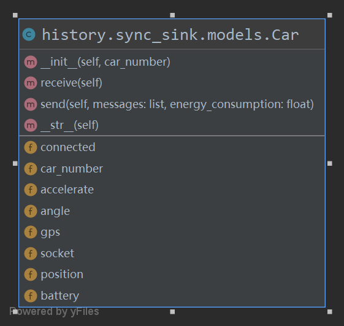

# Sink节点代码文档

## 第一章 简介

### 1.1 概述

对于Sink节点，无论是同步还是异步，都需实现以下四个核心功能：
1. 实现与监控小车的实时通信，包括小车数据的上行和控制命令的下行。
2. 实现与UWB的实时通信，包括UWB周期上报的测距信息。
3. 实现目标跟踪算法，主要是根据三点定位算法求出目标的当前位置，再进行小车的调度。
4. 实现与后端服务器的实时通信，包括监控区域的数据回传。

在同步版本中，目前只实现了功能一、功能二和功能三，功能四将在异步版本中实现，该版本中暂未实现。

### 1.2 项目结构

Sink节点基于Python3开发，项目结构如图：

  

其中，各个目录的含义如下：
1. docs: 该项目的相关文档。
2. history: 该项目的一些历史版本，以及测试例程。
    * original_sink: 最原始版本的Sink代码，主要功能仅为控制小车、获取小车视频流。
    * sync_sink: 同步版本的Sink代码。
    * aio_test: 帮助理解异步模式的测试代码。
3. logs: 记录小车和UWB的回传数据的日志。
4. src: 最新版本的Sink源码，目前是异步版本。

## 第二章 同步版Sink

### 2.1 概述

同步版Sink采取的技术方案为**多线程+BIO**。

对于Sink而言，需要保持和多辆监控小车的TCP socket通信，和三个UWB的TCP socket通信，以及和后端服务器的HTTP通信(同步版未实现)。因此，初步想法是采取多线程的方式，每一个线程以BIO的方式负责一个socket的数据接收，由主线程来实现socket的数据发送。

> *同步版Sink代码涉及的技术除了Python外，主要需要掌握多线程和socket通信。*

同步版Sink主要涉及到的模块为 /history/sync_sink 目录下的几个模块，本章的主要内容将对其中的API进行解析。

### 2.2 models.py

该模块只包含两个重要的类，即Car和UWB。

##### Car类

Car类的UML类图如下：

 

###### Car类的属性

| 属性名     | 类型   | 含义                     |
| ---------- | ------ | ------------------------ |
| car_number | int    | 小车的编号               |
| gps        | List   | 小车的gps                |
| accelerate | List   | 小车的加速度             |
| angle      | List   | 表示小车的角度           |
| position   | List   | 表示小车的平面位置       |
| battery    | float  | 表示小车的电量           |
| connected  | bool   | 表示小车是否已经连接     |
| socket     | Socket | 表示小车对应的socket对象 |

###### Car类的方法
1、receive()：接收小车的上行数据，该方法主要涉及以下任务：

* 通过socket接收上行数据并解析，**解析规则**：每条上行数据只包含一个ACC、Angle、GPS，数据包之间用一个"#"分隔，数据包内的变量间用";"分隔，各变量的内部分量用","分隔。
* 记录小车回传的数据到日志中。

> 在解析上行数据时，需要处理TCP粘包问题，已在receive()中实现。

2、send(messages, energy_consumption)：向小车发送下行数据，并模拟消耗电量

##### UWB类
UWB类的模型大致与Car类相似，这里仅单独miao's

### 2.3 car_control.py

## 第三章 异步版Sink

### 3.1 概述

